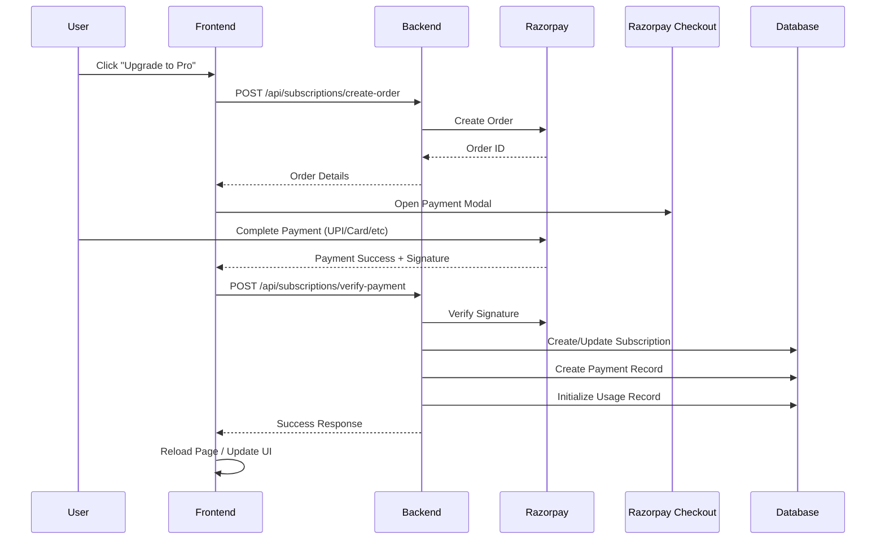

# Smart ML Assistant - Subscription & Billing System Documentation

## Table of Contents
1. [System Overview](#system-overview)
2. [Architecture](#architecture)
3. [Subscription Plans](#subscription-plans)
4. [Payment Integration](#payment-integration)
5. [Usage Tracking](#usage-tracking)
6. [Add-ons System (Planned)](#add-ons-system)
7. [Azure Infrastructure Costs](#azure-infrastructure-costs)
8. [End-to-End Testing Guide](#end-to-end-testing-guide)
9. [API Reference](#api-reference)
10. [Weekly Plan Implementation](#weekly-plan-implementation)

---

## System Overview

The Smart ML Assistant implements a comprehensive subscription and billing system with the following features:

### Core Features
- **Three-tier subscription plans** (Free, Pro, Advanced)
- **Razorpay payment gateway integration** (UPI, Cards, NetBanking, Wallets)
- **Real-time usage tracking** (API calls, model training, storage)
- **Subscription lifecycle management** (create, upgrade, cancel, renew)
- **Dunning system** for failed payment recovery
- **Webhook processing** for payment events
- **Usage-based limits enforcement**
- **Payment history tracking**
- **Azure Blob Storage** for datasets and models

### Technology Stack
- **Backend**: FastAPI (Python)
- **Frontend**: React + TypeScript + Tailwind CSS
- **Database**: MongoDB
- **Payment Gateway**: Razorpay
- **Cloud Storage**: Azure Blob Storage
- **Email**: SMTP (Gmail)

---

## Architecture

### Backend Components

```
backend/
├── app/
│   ├── routers/
│   │   ├── subscriptions.py          # Subscription API endpoints
│   │   └── admin.py                  # Admin management endpoints
│   ├── services/
│   │   ├── subscription_service.py   # Subscription logic & usage tracking
│   │   ├── payment_service.py        # Razorpay integration
│   │   ├── dunning_service.py        # Failed payment recovery
│   │   └── email_service.py          # Email notifications
│   ├── schemas/
│   │   └── subscription_schemas.py   # Pydantic models
│   ├── middleware/
│   │   └── subscription_middleware.py # Usage limit enforcement
│   ├── jobs/
│   │   └── dunning_cron.py          # Scheduled retry jobs
│   └── scripts/
│       └── init_subscription_plans.py # Database initialization
```

### Frontend Components

```
frontend/client/src/
├── pages/
│   └── Billing.tsx                   # Main billing page
└── components/
    ├── SubscriptionPlans.tsx         # Plan cards with Razorpay checkout
    ├── CurrentSubscriptionCard.tsx   # Active subscription details
    ├── UsageDashboard.tsx           # Real-time usage metrics
    └── PaymentHistoryTable.tsx      # Transaction history
```

### Database Collections

1. **plans** - Subscription plan definitions
2. **subscriptions** - User subscription records
3. **usage_records** - Usage tracking per user
4. **payments** - Payment transaction history
5. **webhook_events** - Razorpay webhook logs (idempotent processing)
6. **dunning_attempts** - Failed payment retry tracking

---

## Subscription Plans

### Current Plans

| Feature | Free | Pro | Advanced |
|---------|------|-----|----------|
| **Price (Monthly)** | ₹0 | ₹499 | ₹1,999 |
| **API Calls/Month** | 500 | 5,000 | 50,000 |
| **Models/Day** | 3 | 25 | 100 |
| **Dataset Size Limit** | 50 MB | 500 MB | 2 GB |
| **Azure Storage** | 100 MB | 5 GB | 20 GB |
| **Training Time/Model** | 5 min | 30 min | 120 min |
| **Concurrent Trainings** | 1 | 3 | 10 |
| **Support** | Community | Priority Email | 24/7 Priority |
| **Advanced Metrics** | ❌ | ✅ | ✅ |
| **Custom Pipelines** | ❌ | ❌ | ✅ |
| **SLA Guarantee** | ❌ | ❌ | ✅ |

### Plan Initialization

Run this command to initialize plans in MongoDB:

```bash
cd backend
python -m app.scripts.init_subscription_plans
```

This creates:
- 3 subscription plans in `plans` collection
- Database indexes for performance
- TTL indexes for automatic cleanup

---

## Payment Integration

### Razorpay Configuration

**Test Credentials** (in .env):
```env
RAZORPAY_KEY_ID=rzp_test_RpZRv7QRyMQoWa
RAZORPAY_KEY_SECRET=sWdFSiud8eSjuYS01n7962bB
```

**Production Credentials** (commented out):
```env
RAZORPAY_KEY_ID=rzp_live_RpZ9CuHYNiHmzU
RAZORPAY_KEY_SECRET=wItrCqBCK9ghQgMOkpBSrV58
```

### Payment Flow



### Supported Payment Methods

- **UPI** (Google Pay, PhonePe, Paytm, etc.)
- **Credit/Debit Cards** (Visa, Mastercard, Amex, Rupay)
- **Net Banking** (All major banks)
- **Wallets** (Paytm, PhonePe, Freecharge, etc.)
- **EMI** (Credit card EMI options)

### Webhook Events

The system handles these Razorpay webhook events:

1. **payment.captured** - Payment successful
2. **payment.failed** - Payment failed (triggers dunning)
3. **subscription.charged** - Auto-renewal successful
4. **subscription.cancelled** - Canceled via Razorpay
5. **subscription.paused** - Subscription paused
6. **subscription.resumed** - Subscription resumed

Webhook endpoint: `POST /api/subscriptions/webhook`

**Webhook Security**:
- Signature verification using HMAC-SHA256
- Idempotent processing (events processed only once)
- Complete audit trail in `webhook_events` collection
- Source IP logging

---

## Usage Tracking

### Tracked Metrics

1. **API Hits** - Monthly counter
   - Increments on every API call
   - Resets monthly on billing cycle

2. **Model Training** - Daily counter
   - Tracks models trained per day
   - Auto-resets at midnight UTC

3. **Azure Storage** - Cumulative
   - Tracks total storage used (MB)
   - Datasets + trained models

### Usage Enforcement

**Middleware**: `subscription_middleware.py`

Checks performed before each operation:
- API calls: Check `api_hits_used < api_hits_limit`
- Model training: Check `models_trained_today < models_limit_per_day`
- Dataset upload: Check `file_size_mb <= dataset_size_mb`
- Storage: Check `current_storage + new_file <= azure_storage_gb * 1024`

**HTTP Response**: `403 Forbidden` with upgrade prompt if limit exceeded

### Usage Dashboard

Real-time metrics displayed:
- Current usage vs. limits
- Usage percentage (color-coded: green < 75%, yellow 75-90%, red > 90%)
- Billing cycle dates
- Upgrade prompts at 80%+ usage

---

## Add-ons System (Planned)

### Proposed Add-ons

| Add-on | Description | Price (Monthly) |
|--------|-------------|-----------------|
| **Extra Storage** | +10 GB Azure storage | ₹199 |
| **API Boost** | +10,000 API calls | ₹299 |
| **Model Boost** | +20 models/day | ₹399 |
| **Priority Queue** | Jump to front of training queue | ₹499 |
| **Custom Domain** | Deploy models on custom domain | ₹599 |
| **Advanced Analytics** | Detailed performance insights | ₹299 |
| **White Label** | Remove branding | ₹999 |

### Add-on Implementation Plan

#### Phase 1: Database Schema (Week 4)

```python
# New collection: addon_products
{
    "_id": ObjectId,
    "addon_id": "extra_storage_10gb",
    "name": "Extra Storage (10 GB)",
    "description": "Add 10 GB of Azure storage",
    "type": "storage",  # storage, api, models, feature
    "price_monthly": 199.0,
    "currency": "INR",
    "increment": {
        "azure_storage_gb": 10
    },
    "is_active": True,
    "created_at": datetime,
    "updated_at": datetime
}

# New collection: user_addons
{
    "_id": ObjectId,
    "user_id": ObjectId,
    "subscription_id": ObjectId,
    "addon_id": "extra_storage_10gb",
    "status": "active",  # active, canceled
    "started_at": datetime,
    "ends_at": datetime,
    "amount": 199.0,
    "razorpay_addon_subscription_id": "sub_xxx",
    "created_at": datetime,
    "updated_at": datetime
}
```

#### Phase 2: Backend API (Week 4)

New endpoints:
```
GET    /api/addons                    # List available add-ons
GET    /api/addons/my-addons          # User's active add-ons
POST   /api/addons/purchase           # Purchase add-on
POST   /api/addons/cancel             # Cancel add-on
```

#### Phase 3: Frontend UI (Week 4)

- Add-ons tab in billing page
- Add-on cards with purchase flow
- Active add-ons management
- Combined usage display (base plan + add-ons)

#### Phase 4: Limits Calculation (Week 4)

```python
async def get_total_limits(user_id):
    """Calculate total limits = base plan + all active add-ons"""
    base_limits = await get_plan_limits(user_plan)
    active_addons = await get_user_addons(user_id)

    total_limits = base_limits.copy()
    for addon in active_addons:
        for key, value in addon['increment'].items():
            total_limits[key] += value

    return total_limits
```

---

## Azure Infrastructure Costs

### Azure Blob Storage Pricing (India Central)

**Storage Costs** (Hot Tier - Frequent Access):
- First 50 TB/month: **₹1.50/GB/month** (~$0.0184/GB)
- Next 450 TB/month: ₹1.45/GB/month
- Over 500 TB/month: ₹1.40/GB/month

**Transaction Costs**:
- Write operations: ₹0.40 per 10,000 transactions
- Read operations: ₹0.03 per 10,000 transactions
- List operations: ₹0.40 per 10,000 transactions

**Data Transfer Costs**:
- Upload (ingress): **FREE**
- Download (egress):
  - First 5 GB/month: FREE
  - Next 10 TB/month: ₹6.72/GB (~$0.087/GB)
  - Next 40 TB/month: ₹6.48/GB
  - Over 50 TB/month: ₹6.24/GB

### Cost Calculations Per Plan

#### Free Plan (100 MB storage)
- Storage: 0.1 GB × ₹1.50 = **₹0.15/month**
- Transactions: ~100 uploads/month = **₹0.004/month**
- **Total: ~₹0.15/user/month**

#### Pro Plan (5 GB storage)
- Storage: 5 GB × ₹1.50 = **₹7.50/month**
- Transactions: ~1,000 operations = **₹0.08/month**
- Data transfer: ~2 GB downloads = **₹13.44/month**
- **Total: ~₹21/user/month**

#### Advanced Plan (20 GB storage)
- Storage: 20 GB × ₹1.50 = **₹30/month**
- Transactions: ~5,000 operations = **₹0.40/month**
- Data transfer: ~10 GB downloads = **₹67.20/month**
- **Total: ~₹98/user/month**

### Profit Margins

| Plan | Price | Azure Cost | Margin | Margin % |
|------|-------|------------|--------|----------|
| Free | ₹0 | ₹0.15 | -₹0.15 | N/A |
| Pro | ₹499 | ₹21 | ₹478 | **95.8%** |
| Advanced | ₹1,999 | ₹98 | ₹1,901 | **95.1%** |

**Notes**:
- Margins exclude compute costs (training VMs), API costs (Claude/Gemini), MongoDB Atlas costs, and operational expenses
- Free plan is a loss leader for customer acquisition
- Actual margins depend on user behavior (API usage, model training frequency)

### Additional Azure Services Used

1. **Azure Cognitive Services** (optional):
   - Custom Vision API: ~₹600/month for 10,000 transactions

2. **Azure Container Instances** (for model deployment):
   - 1 vCPU, 1 GB RAM: ~₹1.50/hour = ~₹1,080/month (if running 24/7)
   - Recommended: Scale to zero when not in use

3. **Azure Functions** (for serverless operations):
   - First 1 million executions: **FREE**
   - Additional: ₹0.17 per million executions

### Cost Optimization Strategies

1. **Storage Lifecycle Policies**:
   - Move unused datasets to Cool tier after 30 days (saves 50%)
   - Archive old models after 90 days (saves 80%)

2. **CDN for Static Assets**:
   - Use Azure CDN for model downloads
   - Reduces egress costs significantly

3. **Compression**:
   - Compress datasets before upload (saves storage + transfer)
   - Use .parquet format instead of CSV (70% smaller)

4. **Smart Scaling**:
   - Use Azure Batch for model training (pay per use)
   - Auto-shutdown training VMs after job completion

---

## End-to-End Testing Guide

### Prerequisites

1. **Backend Running**: `uvicorn app.main:app --reload --port 8000`
2. **Frontend Running**: `npm run dev` (port 5173)
3. **MongoDB**: Connected and initialized
4. **Razorpay**: Test mode enabled

### Test Scenarios

#### Scenario 1: View Subscription Plans

1. Navigate to: http://localhost:5173/billing
2. Click "Plans" tab
3. Verify 3 plans displayed (Free, Pro, Advanced)
4. Check pricing, features, and limits

**Expected Result**: All plans render correctly with proper styling

#### Scenario 2: Upgrade to Pro Plan

1. Login as a user
2. Go to Billing > Plans
3. Click "Upgrade Now" on Pro plan
4. Razorpay checkout modal opens
5. Use test card: **4111 1111 1111 1111**
6. CVV: Any 3 digits
7. Expiry: Any future date
8. Complete payment
9. Verify success message
10. Page reloads automatically
11. Check "Current Subscription" card shows Pro plan

**Expected Result**: Subscription activated, user upgraded to Pro

#### Scenario 3: View Usage Dashboard

1. Go to Billing > Usage
2. Verify 3 usage cards displayed:
   - API Hits
   - Models Today
   - Storage Used
3. Check progress bars and percentages
4. Make some API calls to test counter increment
5. Refresh page, verify counters updated

**Expected Result**: Real-time usage tracking working

#### Scenario 4: Payment History

1. Go to Billing > History
2. Verify recent payment displayed
3. Check payment details:
   - Amount
   - Payment method
   - Status
   - Date
   - Transaction ID

**Expected Result**: Complete payment history with all details

#### Scenario 5: Cancel Subscription

1. Go to Billing > Overview
2. Click "Cancel Subscription"
3. Choose "Cancel at period end"
4. Confirm cancellation
5. Verify warning banner appears
6. Check subscription status

**Expected Result**: Subscription marked for cancellation, active until period end

#### Scenario 6: Test Usage Limits

1. Create script to make 501 API calls (exceeds Free limit)
2. Verify 403 error on 501st call
3. Upgrade to Pro
4. Retry - should succeed
5. Test model training limit (train 4 models on Free)
6. Verify 4th training blocked

**Expected Result**: Limits enforced correctly

#### Scenario 7: Webhook Testing

1. Use Razorpay Dashboard > Webhooks
2. Trigger test event: `payment.captured`
3. Check backend logs for webhook received
4. Verify `webhook_events` collection has entry
5. Check idempotency - resend same event
6. Verify event not processed twice

**Expected Result**: Webhooks processed correctly with idempotency

### Test Razorpay Cards

| Card Number | Behavior |
|-------------|----------|
| 4111 1111 1111 1111 | Success |
| 4012 0010 3714 1112 | Requires 3D Secure (OTP) |
| 5104 0600 0000 0008 | Success (Mastercard) |
| 5555 5555 5555 4444 | Declined |

### Test UPI IDs
- `success@razorpay` - Payment succeeds
- `failure@razorpay` - Payment fails

### Automated Testing Script

```python
import requests
import time

BASE_URL = "http://localhost:8000"
TOKEN = "your_jwt_token_here"

headers = {
    "Authorization": f"Bearer {TOKEN}"
}

def test_get_plans():
    """Test GET /api/subscriptions/plans"""
    response = requests.get(f"{BASE_URL}/api/subscriptions/plans", headers=headers)
    assert response.status_code == 200
    plans = response.json()
    assert len(plans) == 3
    print("✅ Plans fetched successfully")

def test_get_usage():
    """Test GET /api/subscriptions/usage"""
    response = requests.get(f"{BASE_URL}/api/subscriptions/usage", headers=headers)
    assert response.status_code == 200
    usage = response.json()
    assert "api_hits_used" in usage
    print("✅ Usage fetched successfully")

def test_create_order():
    """Test POST /api/subscriptions/create-order"""
    response = requests.post(
        f"{BASE_URL}/api/subscriptions/create-order",
        json={"plan": "pro"},
        headers=headers
    )
    assert response.status_code == 200
    order = response.json()
    assert "order_id" in order
    print(f"✅ Order created: {order['order_id']}")

if __name__ == "__main__":
    test_get_plans()
    test_get_usage()
    test_create_order()
    print("\n✅ All tests passed!")
```

---

## API Reference

### Base URL
```
http://localhost:8000/api/subscriptions
```

### Endpoints

#### 1. Get All Plans
```http
GET /plans
```

**Response**:
```json
[
  {
    "id": "...",
    "plan": "pro",
    "name": "Pro Plan",
    "description": "Perfect for individual developers",
    "price_monthly": 499.0,
    "currency": "INR",
    "api_hits_per_month": 5000,
    "model_generation_per_day": 25,
    "dataset_size_mb": 500,
    "azure_storage_gb": 5,
    "training_time_minutes_per_model": 30,
    "concurrent_trainings": 3,
    "features": [
      "Advanced AutoML training",
      "Up to 25 models/day",
      "5,000 API calls/month",
      ...
    ],
    "priority_support": true,
    "is_active": true
  }
]
```

#### 2. Get Current Subscription
```http
GET /current
Authorization: Bearer {token}
```

**Response**:
```json
{
  "id": "...",
  "user_id": "...",
  "plan": "pro",
  "provider": "razorpay",
  "status": "active",
  "period_start": "2024-01-01T00:00:00Z",
  "period_end": "2024-02-01T00:00:00Z",
  "cancel_at_period_end": false,
  "amount": 499.0,
  "currency": "INR",
  "next_billing_date": "2024-02-01T00:00:00Z"
}
```

#### 3. Create Order
```http
POST /create-order
Authorization: Bearer {token}
Content-Type: application/json

{
  "plan": "pro"
}
```

**Response**:
```json
{
  "order_id": "order_xxx",
  "amount": 499.0,
  "currency": "INR",
  "key_id": "rzp_test_xxx",
  "plan": "pro"
}
```

#### 4. Verify Payment
```http
POST /verify-payment
Authorization: Bearer {token}
Content-Type: application/json

{
  "razorpay_order_id": "order_xxx",
  "razorpay_payment_id": "pay_xxx",
  "razorpay_signature": "...",
  "plan": "pro"
}
```

**Response**:
```json
{
  "success": true,
  "subscription_id": "...",
  "plan": "pro",
  "message": "Subscription activated successfully"
}
```

#### 5. Cancel Subscription
```http
POST /cancel
Authorization: Bearer {token}
Content-Type: application/json

{
  "cancel_at_period_end": true,
  "reason": "Too expensive"
}
```

**Response**:
```json
{
  "success": true,
  "message": "Subscription will be canceled at period end",
  "cancel_at_period_end": true,
  "period_end": "2024-02-01T00:00:00Z"
}
```

#### 6. Get Usage
```http
GET /usage
Authorization: Bearer {token}
```

**Response**:
```json
{
  "user_id": "...",
  "subscription_id": "...",
  "plan": "pro",
  "api_hits_used": 1250,
  "api_hits_limit": 5000,
  "models_trained_today": 8,
  "models_limit_per_day": 25,
  "azure_storage_used_mb": 342.5,
  "azure_storage_limit_gb": 5,
  "billing_cycle_start": "2024-01-01T00:00:00Z",
  "billing_cycle_end": "2024-02-01T00:00:00Z",
  "usage_percentage": {
    "api_hits": 25.0,
    "models": 32.0,
    "storage": 6.85
  }
}
```

#### 7. Get Payment History
```http
GET /payment-history
Authorization: Bearer {token}
```

**Response**:
```json
[
  {
    "id": "...",
    "amount": 499.0,
    "currency": "INR",
    "status": "success",
    "payment_method": "upi",
    "razorpay_payment_id": "pay_xxx",
    "description": "Subscription: Pro Plan",
    "created_at": "2024-01-01T00:00:00Z"
  }
]
```

#### 8. Webhook
```http
POST /webhook
X-Razorpay-Signature: {signature}
Content-Type: application/json

{
  "event": "payment.captured",
  "payload": {
    "payment": {
      "entity": {
        "id": "pay_xxx",
        "amount": 49900,
        "status": "captured",
        ...
      }
    }
  }
}
```

---

## Weekly Plan Implementation

### Why Weekly Plans?

Many users prefer weekly billing for:
- Lower commitment / easier to try
- Better cash flow management
- More flexible testing period

### Weekly Plan Pricing Strategy

**Pricing Formula**: `Weekly Price = (Monthly Price / 4) × 1.15`
- Divide by 4 to get base weekly price
- Add 15% premium for administrative overhead

| Plan | Monthly | Weekly (Calculated) | Weekly (Final) |
|------|---------|---------------------|----------------|
| Pro | ₹499 | ₹143.56 | **₹149** |
| Advanced | ₹1,999 | ₹575.71 | **₹599** |

### Implementation Steps

#### Step 1: Update Plans Collection

Add weekly billing option to existing plans:

```python
{
    "plan": "pro",
    "billing_cycles": {
        "monthly": {
            "price": 499.0,
            "period_days": 30,
            "api_hits": 5000,
            "models_per_day": 25,
            # ... other limits
        },
        "weekly": {
            "price": 149.0,
            "period_days": 7,
            "api_hits": 1250,      # 5000 / 4
            "models_per_day": 25,  # Same as monthly (daily limit)
            # ... scaled limits
        }
    }
}
```

#### Step 2: Update Schemas

```python
# subscription_schemas.py

class CreateOrderRequest(BaseModel):
    plan: str  # "pro" | "advanced"
    billing_cycle: str = "monthly"  # "weekly" | "monthly"

class BillingCycleOption(BaseModel):
    price: float
    period_days: int
    api_hits: int
    models_per_day: int
    dataset_size_mb: int
    azure_storage_gb: int
    training_time_minutes_per_model: int
    concurrent_trainings: int

class PlanResponse(BaseModel):
    id: str
    plan: str
    name: str
    billing_cycles: Dict[str, BillingCycleOption]
    features: List[str]
    priority_support: bool
    is_active: bool
```

#### Step 3: Update Backend Service

```python
# payment_service.py

async def create_order(
    self,
    user_id: ObjectId,
    plan_name: str,
    billing_cycle: str = "monthly"  # NEW PARAMETER
) -> Dict[str, Any]:
    plan = await self.get_plan_details(plan_name)

    # Get pricing for selected billing cycle
    cycle_config = plan.billing_cycles[billing_cycle]
    amount_paise = int(cycle_config['price'] * 100)

    order_data = {
        "amount": amount_paise,
        "currency": "INR",
        "notes": {
            "user_id": str(user_id),
            "plan": plan_name,
            "billing_cycle": billing_cycle
        }
    }

    # ... rest of the logic
```

#### Step 4: Update Frontend

```tsx
// SubscriptionPlans.tsx

const [billingCycle, setBillingCycle] = useState<'weekly' | 'monthly'>('monthly');

// Add toggle switch
<div className="flex justify-center mb-6">
  <div className="bg-gray-100 p-1 rounded-lg flex gap-1">
    <button
      className={`px-4 py-2 rounded ${billingCycle === 'monthly' ? 'bg-white shadow' : ''}`}
      onClick={() => setBillingCycle('monthly')}
    >
      Monthly <span className="text-green-600">(Save 15%)</span>
    </button>
    <button
      className={`px-4 py-2 rounded ${billingCycle === 'weekly' ? 'bg-white shadow' : ''}`}
      onClick={() => setBillingCycle('weekly')}
    >
      Weekly
    </button>
  </div>
</div>

// Update price display
<div className="text-4xl font-bold">
  {formatCurrency(plan.billing_cycles[billingCycle].price)}
  <span className="text-lg text-gray-500">/{billingCycle === 'weekly' ? 'week' : 'month'}</span>
</div>

// Update upgrade handler
const orderResponse = await axios.post(
  'http://localhost:8000/api/subscriptions/create-order',
  { plan: planName, billing_cycle: billingCycle },
  { headers: { Authorization: `Bearer ${token}` } }
);
```

#### Step 5: Update Usage Limits

Weekly plans need different limit calculations:

```python
# subscription_service.py

async def get_usage_stats(self, user_id: ObjectId) -> Dict[str, Any]:
    subscription = await self.get_user_subscription(user_id)

    # Get limits based on billing cycle
    if subscription['billing_cycle'] == 'weekly':
        api_limit = subscription['limits']['api_hits'] # Already scaled (1250)
        days_in_cycle = 7
    else:
        api_limit = subscription['limits']['api_hits'] # 5000
        days_in_cycle = 30

    # Calculate daily prorated limits if needed
    # ...
```

### Marketing Weekly Plans

**Value Propositions**:
1. "Try Pro for just ₹149/week"
2. "No long-term commitment"
3. "Perfect for short projects"
4. "Pay-as-you-grow flexibility"

**Target Audience**:
- Students working on semester projects
- Freelancers with short-term clients
- Startups validating MVP
- Users wanting to test before monthly commitment

---

## Future Enhancements

### Phase 1: Add-ons (Week 4)
- Implement add-on purchase flow
- Combined limits calculation
- Add-on management UI

### Phase 2: Annual Plans (Month 2)
- Annual billing with 20% discount
- Upfront payment processing
- Prorated upgrades

### Phase 3: Team Plans (Month 3)
- Multi-user subscriptions
- Shared usage pools
- Role-based access control

### Phase 4: Enterprise (Month 4)
- Custom pricing
- Volume discounts
- Dedicated support
- SLA agreements
- Invoice billing

### Phase 5: Usage-Based Billing (Month 5)
- Pay only for what you use
- No monthly limits
- Per-API-call pricing
- Per-GB storage pricing

---

## Support & Troubleshooting

### Common Issues

#### 1. Payment Fails
**Symptoms**: Razorpay checkout fails or signature verification fails

**Solutions**:
- Check Razorpay test mode is enabled
- Verify API keys in .env
- Check webhook secret is correct
- Use test cards provided in docs

#### 2. Usage Not Updating
**Symptoms**: API calls made but counter doesn't increase

**Solutions**:
- Check middleware is properly registered
- Verify `increment_api_usage()` is called
- Check MongoDB connection
- Look for errors in backend logs

#### 3. Plans Not Loading
**Symptoms**: Empty plans list in frontend

**Solutions**:
- Run `init_subscription_plans.py` script
- Check MongoDB connection
- Verify backend is running
- Check CORS configuration

#### 4. Webhook Not Received
**Symptoms**: Payments succeed but subscription not activated

**Solutions**:
- Check webhook URL in Razorpay dashboard
- Verify webhook endpoint is accessible
- Check signature verification
- Look at `webhook_events` collection

### Contact & Support

For issues or questions:
- Email: support@smartml.com
- Docs: https://docs.smartml.com
- GitHub: https://github.com/yourorg/smart-ml-assistant

---

## Changelog

### Version 1.0.0 (Current)
- ✅ Three-tier subscription plans
- ✅ Razorpay payment integration
- ✅ Usage tracking and limits
- ✅ Webhook processing
- ✅ Dunning system
- ✅ Payment history
- ✅ Real-time usage dashboard

### Planned for Version 1.1.0 (Week 4)
- 🔄 Add-ons system
- 🔄 Weekly billing cycles
- 🔄 Email notifications
- 🔄 Dunning automation (cron jobs)

### Planned for Version 1.2.0 (Month 2)
- 📅 Annual plans
- 📅 Proration on upgrades
- 📅 Referral program
- 📅 Admin dashboard

---

**Last Updated**: December 9, 2024
**Author**: Smart ML Assistant Development Team
